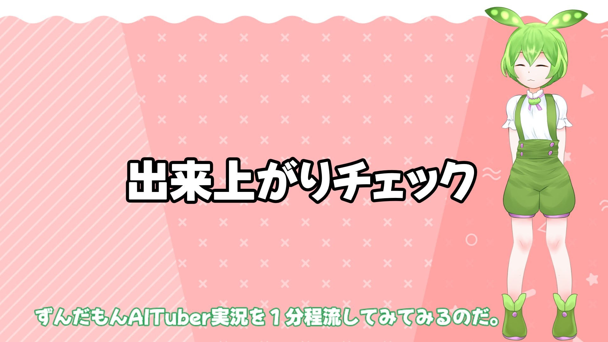

# rinna-4b-multimodal-hello-aituber

最初に、こちらの解説記事をお読みください。


rinna-4b マルチモーダルモデルを使用した簡単なゲーム実況デモ動画（5分）
こちらを見てもらうと、何がチュートリアルで作れるのかイメージしやすいと思います。
[](https://www.youtube.com/watch?v=0FU1334TgGM)

動画は時間がかかるので見ないという人向けには、こんなの作れないかなと思って一番最初に作りはじめる前に検討で作った[モックイメージ動画(20秒)](https://twitter.com/dev_inada/status/1686489508005675015)だけ見るでも良いと思います。

## 動作確認環境
- ubuntu環境(wsl可) (windows環境ではこの手順では動かないところがあります。windowsで動かすやり方はググったりジピったりして頑張るといけるとは思います)
- python 3.10.8
- cuda 11.8

## システム構成
動画から定期的に画像を抽出し、画像の状況説明をマルチモーダルモデルにさせてアバターにしゃべらせているだけです。



## 必要モジュールのインストール

```
git clone https://github.com/takaaki-inada/rinna-4b-multimodal-hello-aituber.git
cd rinna-4b-multimodal-hello-aituber
python -m venv .venv
source .venv/bin/activate  # windows環境だと既にここから手順違います
pip install --upgrade pip setuptools
pip install -r MiniGPT-4/aituber/requirements.txt
wget -O MiniGPT-4/checkpoint.pth https://huggingface.co/rinna/bilingual-gpt-neox-4b-minigpt4/resolve/main/checkpoint.pth
sudo apt install redis-server
```

### 表情をつける場合に必要なモジュールをインストールする手順
ここは参考程度に記載。このインストール手順は環境依存するため、あくまで自力でお試しが出来る人向け（表情機能は最初はオフ状態）。この手順はスキップでOK。
```
sudo apt install mecab libmecab-dev mecab-ipadic-utf8
pip install mecab-python3
pip install pymlask
git clone --depth 1 https://github.com/neologd/mecab-ipadic-neologd.git
cd mecab-ipadic-neologd
./bin/install-mecab-ipadic-neologd -n -y
cd ..
```

## webuiを起動してモデルが動くことを確認する

セットアップがうまく出来たか確認のために初回だけ実行する手順（モデルを微調整した場合の確認等にも利用でき便利）
```
cd MiniGPT-4
python aituber/app_streaming.py
```
webuiを起動。画像をUploadし、画像の質問をしてそれらしい答えが返ってくればOK。

## 簡単なAITuberを動かす

### 画像キャッシュ用サーバを起動する
```
sudo systemctl start redis-server
# # wsl環境でsystemctlを入れてない場合は、上記に代えて単純にコマンドライン起動でもOK
# redis-server
# # docker派の人は、上記に代えて以下でもOK
# docker run -p 6379:6379 -it redis/redis-stack:latest
```

### 画像を見て応答文生成を行うStreaming APIサーバを起動する

```
# ルートディレクトリにいる場合の手順
cd MiniGPT-4
uvicorn aituber.api_streaming:app --reload --port 8000 --workers 1 --ws-max-size 1
```

### 動画streamを画像キャッシュサーバに接続
videoまわりは製品や動かすPC環境にもよるため、ここでは単純に動画ファイルを再生して画像キャッシュサーバにプールする簡単なプログラムを実行
```
# ルートディレクトリで実行
python mock_camera.py
```

### AITuberのアバターをChatVRMで起動する

```
# ルートディレクトリにいる場合の手順
cd ChatVRM
npm install
npm run dev
```

### 備忘録
チュートリアル記事向けのリポジトリなのでここではやらないけど、docker-composeで全部あげたほうが運用はラクそう

## 自力でお試しできる人向け

### 表情
機能自体は以下でオン。mecabのセットアップが完了している必要がある。使うVRMモデルが表情をどう実装しているかに強く依存。
また、ChatVRMの実装がkoeiroの音声APIを実行してないと(実行エラーだと)VRMの表情の設定を行わない（と思われる）
MiniGPT-4/aituber/app_streaming.py
26行目
```
is_use_expression = True
```

### LLM学習
LLM部分を学習させる手順は前回の記事とほぼ同じ。Rinna-3.6Bではなくrinna/bilingual-gpt-neox-4bでLoRAを作る。自力でお試しが出来る人なら簡単に出来るハズ。
[ローカルで動く大規模言語モデル(Rinna-3.6B)を使ってあなただけのAIパートナーを作ろう - Qiita](https://qiita.com/takaaki_inada/items/9a9c07e85e46ec0e872e)

出来たLoRAを適用する (パスを指定するだけ)
MiniGPT-4/aituber/app_streaming.py
46行目
```
model = CustomizedMiniGPT4(gpt_neox_model="rinna/bilingual-gpt-neox-4b", low_resource=True, lora_model="ここにLoRAのパスを書く")
```
